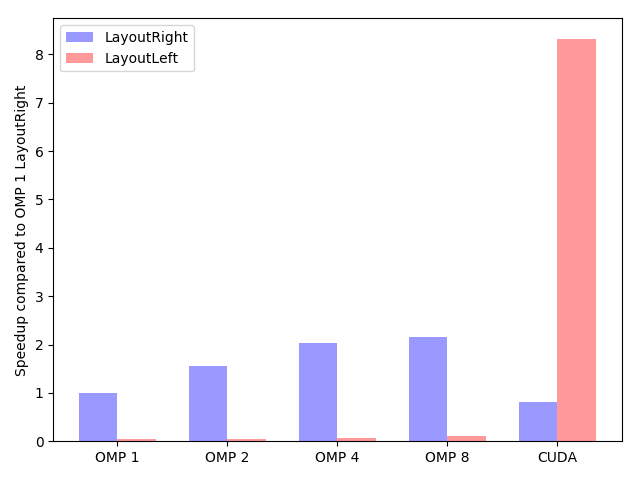
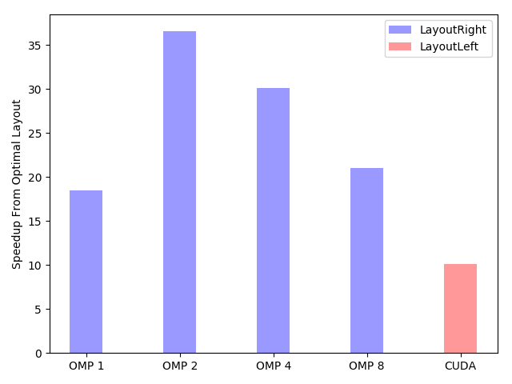

# Kokkos Array of Dot Products

This code is an example of using the hardware agnostic Kokkos C++ library to do a simple dot product operation in parallel for an array of vectors.

[Kokkos](https://github.com/kokkos/kokkos) is a C++ programming model for writing performance portable applications targeting all major HPC platforms.  This model allows one code to be written that can use OpenMP, Pthreads, and CUDA as the backend.

The most distinguishing feature of Kokkos compared to other hardware agnostic libraries is polymorphic multidimensional arrays that are layed out optimally in memory for the target platform.  **Figure 1** shows speedup results of this code using OpenMP and CUDA as the backend with both right (row-major) and left (column-major) memory layouts.

||
|-----------------------|
|**Figure 1**. Speedup compared to OpenMP with one thread (OMP 1) and right memory layout (row-major).|

Layout right is optimal for caching on the CPU, and gives the best performance with OpenMP.  Layout left is optimal for coalescing on the GPU, and gives the best performance with CUDA.  Using a non-optimal memory layout (left for the CPU and right for the GPU) causes this code to run approximately 20x slower with OpenMP and 10x slower with CUDA, as shown in **Figure 2**.

||
|-----------------------|
|**Figure 2**. Speedup from using the optimal memory layout for the respective platform.|

*Hardware: Intel(R) Core(TM) i7-7700HQ CPU @ 2.80GHz, GeForce GTX 1050 Ti GPU.*

## Run Command
```sh
./Kokkos_array_of_dot_products.host -num_vectors 20000 -length 10000 -nrepeat 200
```


